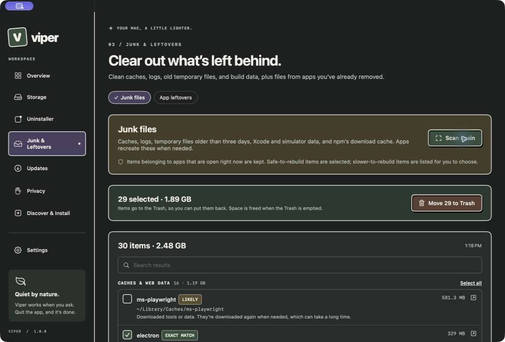
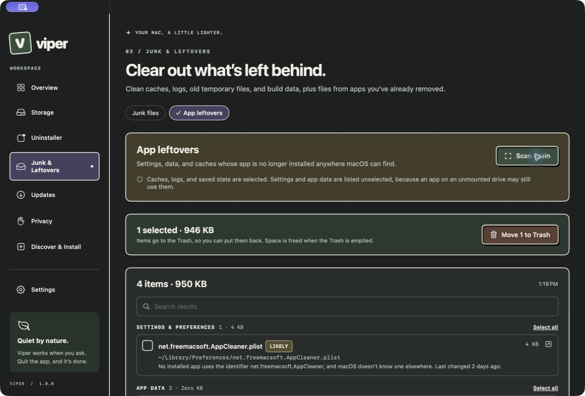
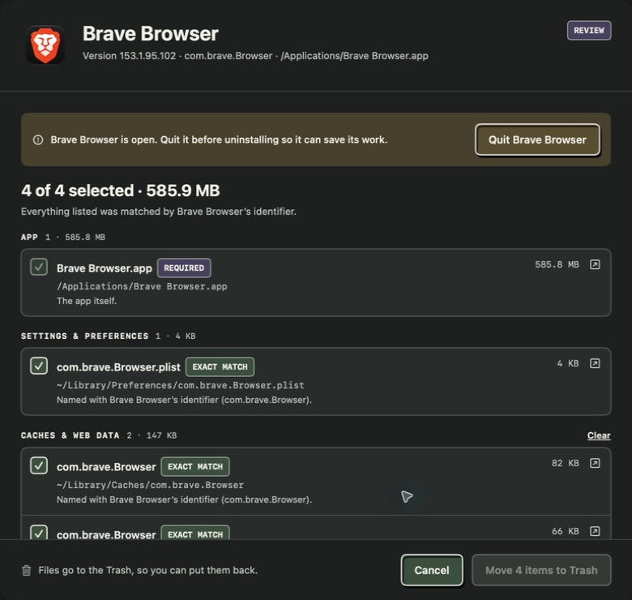
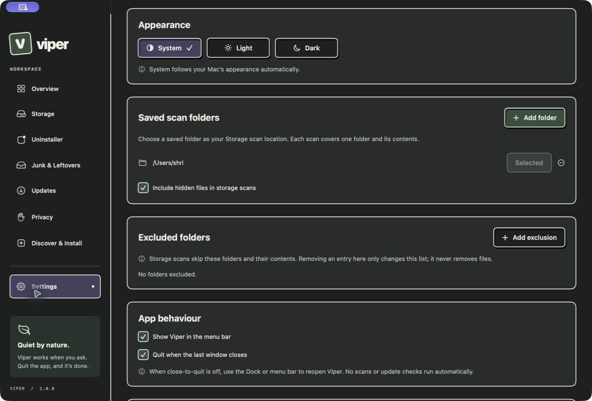
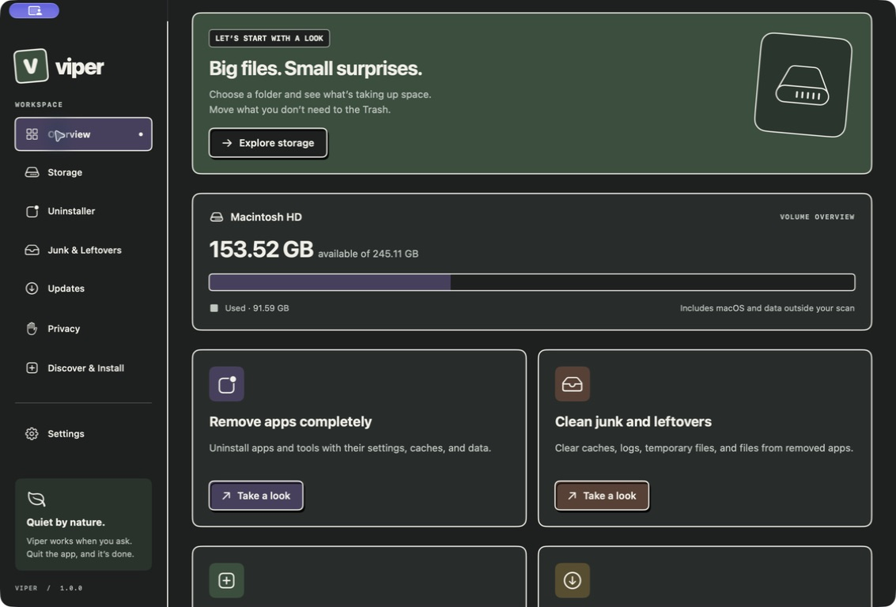
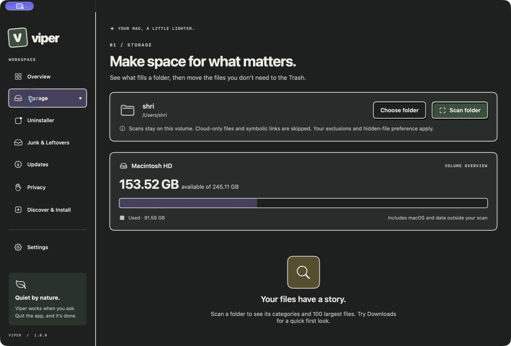
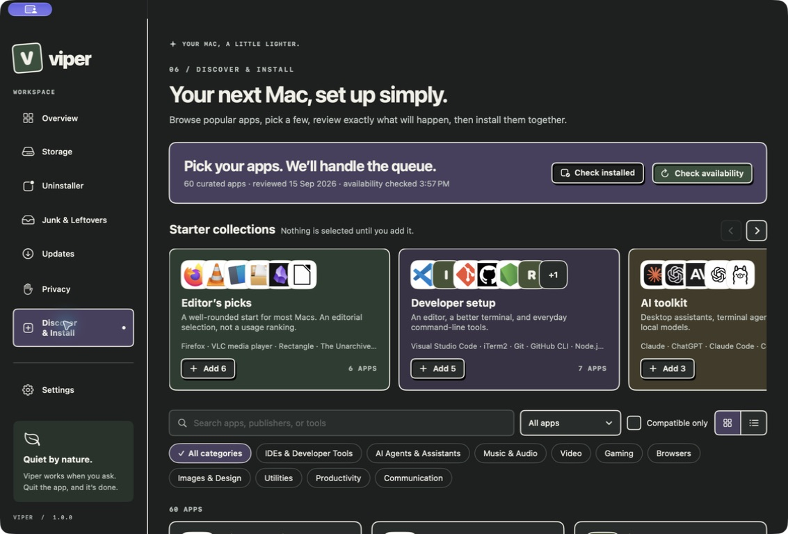

# Viper safety, functionality, architecture, security, and UX audit

Date: 17 September 2026  
Scope: current source tree and locally packaged `dist/Viper.app`  
Verdict: **No-go for production destructive use.** The read-only inventory surfaces are a promising beta, but cleanup, leftovers, uninstall, package mutation, and global Trash deletion must be hardened before normal or power users should trust them with critical files.

## What was verified

- `swift test`: 63 tests passed, 0 failed.
- Release build: succeeded.
- Strict Swift concurrency diagnostic build: succeeded with no warnings.
- Packaged app: internally code-signed with an ad-hoc signature and launched successfully.
- Live flows inspected: Overview, Storage, Uninstaller, uninstall review, Junk, Leftovers, Updates, Privacy, Discover & Install, Settings, cleanup confirmation, privacy-reset confirmation, and an expandable review section.
- No file was deleted, no Trash was emptied, no permission was reset, and no package was installed, updated, or uninstalled.

## Release blockers

### 1. Critical — a currently running app's cache can be preselected for deletion

The live Junk scan preselected `~/Library/Caches/Codex` while the Codex/ChatGPT desktop app was open. The UI simultaneously promises that items belonging to open apps are kept.

The scanner maps a cache owner using bundle-identifier prefixes or a heuristic comparison against localized app names (`Sources/ViperCore/LeftoverScanner.swift:199`). A cache called `Codex` does not match the running bundle identifier `com.openai.codex`, and an app localized as `ChatGPT` does not match the folder name. More importantly, the process list is captured once before the operation (`Sources/Viper/CleanupModel.swift:133`) and reused for the whole deletion batch (`Sources/Viper/CleanupModel.swift:138`); an app launched after that snapshot is not protected.

Required fix: resolve ownership from bundle metadata, receipts, historical inventory, known cache mappings, and open file handles; reread running processes immediately before every item; default unknown caches to unselected; never label heuristic matches `EXACT MATCH`.

### 2. Critical — execution is not race-safe enough for the product's claims

Revalidation checks device/inode and canonical parent, then later calls path-based `FileManager.trashItem` (`Sources/ViperCore/Uninstaller.swift:430`, `Sources/ViperCore/Uninstaller.swift:407`). That is a time-of-check/time-of-use window. For directories, the inode can remain unchanged while new or sensitive contents are moved into the directory after review. Storage files get a size check while the action plan is built (`Sources/ViperCore/LeftoverScanner.swift:298`), but size is not checked again in `identityChanged` immediately before the Trash move.

Required fix: use descriptor-relative operations where macOS permits them; record and recheck type, device, inode, link count, size, timestamps, volume, and a bounded directory manifest; reject any changed directory; ensure the final move cannot follow a substituted path. The UI must say “best-effort recheck” until this is genuinely atomic.

### 3. Critical — destructive operations have no write-ahead journal or crash recovery

Removal results are journaled only after the entire async operation returns, and journal errors are discarded with `try?` (`Sources/Viper/CleanupModel.swift:148`, `Sources/Viper/UninstallModel.swift:138`). A crash, power loss, forced quit, full disk, or permission error can leave changes with no durable record. There is no operation ID, planned-target record, per-item commit record, resume/reconcile path, or startup recovery screen.

Required fix: atomically persist the reviewed plan before mutation, append and fsync each item transition, store Trash destination immediately, reconcile incomplete operations at launch, and block destructive work if the journal cannot be written.

### 4. High — Leftovers produces false-positive ownership claims

The live scan offered `group.com.facebook.family` as an app-data leftover and stated that no installed app uses it even though WhatsApp is installed. It was unselected, which limits immediate damage, but the finding and explanation are not trustworthy. The developer comparison uses only the first two identifier components (`Sources/ViperCore/LeftoverScanner.swift:138`), which cannot connect a Meta/Facebook group container to `net.whatsapp.WhatsApp`.

Required fix: inspect application entitlements for application groups, team identifiers, helper bundles, receipts, Launch Services, and historical ownership. If ownership is not proven, say “owner not confirmed” and do not offer deletion by default.

### 5. High — “Remove apps, completely” is materially overstated

The Brave review found the app, one preference, and two small cache/HTTP folders, but not the browser profile under the vendor-named Application Support hierarchy. Matching is limited to bundle-identifier prefixes and exact cleaned app names (`Sources/ViperCore/Uninstaller.swift:175`). It does not establish ownership through package receipts, entitlements, login items, system extensions, browser profiles, privileged helpers, frameworks, shared services, or an official uninstaller.

Required fix: change the claim to “Remove the app and confidently matched files” now. Add signed, versioned per-app recipes; official-uninstaller handoffs; package receipts; entitlement/team-ID mapping; login/system extension discovery; multiple-user and multiple-volume coverage; and an explicit unsupported-items report.

### 6. High — timed-out package operations can continue in child processes

`CommandRunner` terminates and then kills only the directly launched process (`Sources/ViperCore/CommandRunner.swift:65`). Homebrew, npm, installers, scripts, curl, and compilers can spawn descendants. Those descendants can survive while Viper reports that the operation “was stopped.”

Required fix: create and manage a dedicated process group, terminate the group with a staged policy, detect surviving descendants, and never report stopped until the whole operation tree is settled. Preserve a recovery log and re-inventory after timeout.

### 7. High — Empty Trash permanently deletes unrelated user data

Viper exposes a one-click confirmation that asks Finder to empty every Trash, including items Viper did not create (`Sources/Viper/CleanupModel.swift:203`). The action is global, permanent, not journaled, and offers no item count, size, age, volume list, or typed confirmation.

Required fix: remove this action from the main cleanup flow. Prefer “Open Trash.” If retained, require a high-friction confirmation, enumerate what can be enumerated, clearly separate Viper-created items from other items, and record the request and Finder outcome.

### 8. High — the distributable is not release-secure or portable

The app is ad-hoc signed, has no Team ID, is not notarized, has no hardened-runtime flag, and is a thin arm64 binary. `spctl` does not accept it as a normal distributed build. This is incompatible with a trusted system-maintenance product and with the stated Intel-support direction.

Required fix: reproducible release pipeline, Developer ID signing, hardened runtime, notarization/stapling, universal binary or explicit architecture support, SBOM/dependency provenance, release hashes, update-signing strategy, and CI verification on each supported macOS version.

### 9. High — package trust and runtime identity are not pinned

Viper validates package-name syntax and rechecks versions, which is good, but it executes detected `brew`/`npm` paths without pinning executable identity, ownership, permissions, or code/hash across review and execution. It inherits almost the entire parent environment (`Sources/ViperCore/CommandRunner.swift:45`) and npm uses the user's configured registry. The review does not show registry, tarball integrity, cask checksum, signing identity, or publisher verification.

Required fix: verify runtime owner/mode/path/identity before every command; sanitize the environment with an allowlist; show npm registry and package integrity/provenance; surface cask URL/checksum/signature information; warn on custom registries and mutable runtime paths.

### 10. High — update side effects are under-disclosed

The Updates UI gives only a general warning that Homebrew may update dependencies. It does not show dependency changes, major-version risk, release notes, required disk space, lifecycle scripts, services restarted, migrations, or downgrade/recovery guidance per item. Homebrew updates are not pinned to the reviewed target version in the same way npm updates are.

Required fix: generate a per-update plan with version delta classification, dependency diff, cask/formula metadata, services, conflicts, disk estimate, and recovery instructions; separate security updates from feature upgrades.

## Product and UX gaps

### 11. High — Settings lacks safety controls expected for a destructive utility

Settings currently covers theme, scan folders, exclusions, hidden files, app behavior, and update sources. Missing controls include:

- safety mode and automatic-selection policy;
- “never offer permanent Trash deletion” and confirmation strength;
- Full Disk Access status and coverage diagnostics;
- journal/history viewer, export, retention, clear-data, and recovery;
- network/privacy controls, including App Store lookups and custom npm registries;
- scan resource limits, external-volume policy, cloud-placeholder policy, and stale-result lifetime;
- package-manager/runtime selection and trust diagnostics;
- per-feature exclusions and protected paths;
- reset defaults and support bundle generation.

### 12. Medium — page navigation preserves the previous page's scroll position

After scrolling through Discover and opening Settings, Settings appeared mid-page with its title missing. Returning to Overview also opened partway down the page. The root uses one outer `ScrollView` around the page switch (`Sources/Viper/ViperApp.swift:104`), so the offset is shared across unrelated destinations.

Required fix: give each page its own scroll container/state or reset scroll position on navigation; restore a page's own prior position only when that behavior is intentional.

### 13. Medium — Storage is a largest-file viewer, not a full storage analyzer

It keeps only the 100 largest files and has no largest-folder tree, duplicate finder, snapshots/purgeable explanation in context, drill-down, multi-folder comparison, export, date/owner filters, or stale-scan invalidation. The volume-capacity card beside a single-folder scan can imply the scan explains the whole volume.

Required fix: add hierarchical folder totals, clear scanned-vs-volume accounting, freshness state, robust filters, duplicate/clone-aware analysis, coverage map, and an explicit read-only mode.

### 14. Medium — stale catalog metadata is presented too confidently

Discover showed “availability checked 3:57 PM” while the current audit time was earlier and omitted the date in the summary. Cards said “Ready to install,” even though cached metadata can be old. Installation is revalidated later, which is a strong safety pass, but the browsing state is still misleading.

Required fix: always show date and age, mark stale/unknown availability, distinguish cached from freshly checked data, and never use “Ready” when metadata is absent or expired.

### 15. Medium — accessibility and responsive behavior remain unproven

Many controls have labels and the disclosure control correctly reports expanded/collapsed state. However, fonts and the uninstall sheet use fixed sizes (`Sources/Viper/UninstallViews.swift:25`), the app has a 960×680 minimum, custom controls need keyboard/focus-ring validation, and no VoiceOver, zoom/reflow, Increase Contrast, Differentiate Without Color, or Full Keyboard Access pass is automated.

Required fix: add UI tests for keyboard-only operation and focus order; audit VoiceOver announcements; test Reduce Motion, Increase Contrast, large text/zoom, 960×680, and multi-display layouts; avoid fixed-height sheets for content-heavy review.

## Architecture findings

- The separation between `ViperCore` and SwiftUI is good, but all operations are coordinated through a large `AppModel` plus boolean gates. A single operation actor/state machine should own mutual exclusion, cancellation, durable state, and recovery.
- Static filesystem/provider functions make safe integration testing harder. Introduce protocols for filesystem, process runner, inventory, Trash, journal, and clock, then add fault-injection tests.
- There is no disposable end-to-end harness for real Trash moves, child-process trees, package-manager partial failure, power-loss recovery, Full Disk Access differences, or multi-volume behavior.
- Settings are silently reset to defaults when decoding fails (`Sources/Viper/AppSettings.swift:19`), with no migration, corruption warning, or schema version.

## Safe passes worth preserving

- Commands use a fixed executable plus argument arrays, not shell interpolation.
- Package names and bundle identifiers are validated before use.
- npm installs and updates pin the reviewed exact version.
- Failed/unknown provider inventory is generally treated as unknown rather than absent.
- Mutating install and update queues are serialized.
- Symlink roots/entries are rejected, hard links are deduplicated, cloud-only files are skipped, and nested volumes are omitted from storage scans.
- Files are moved to Trash rather than directly unlinked; app/package removal is rechecked and related data is kept when the required app/package removal fails.
- System apps, Viper itself, Homebrew dependencies, and bundled npm tools have meaningful blockers.
- No administrator escalation, private TCC database access, telemetry, daemon, login item, or background scan was found.
- Confirmation dialogs exist for cleanup, uninstall, privacy reset, and Empty Trash.

## Screen-by-screen health

1. Overview — **Needs work**: clear entry points, but cross-page scroll retention hides context.
2. Storage — **Partial**: safe read-only framing; incomplete analysis and freshness/coverage tooling.
3. Uninstaller list — **Partial**: good search/filtering and source labels; coverage is narrower than “complete.”
4. Uninstall review — **Unsafe claim**: strong review UI, but ownership and race guarantees are insufficient.
5. Junk — **Unsafe defaulting**: useful grouping; live app cache was preselected.
6. Leftovers — **Unsafe classification**: conservative selection for app data, but ownership explanation was false.
7. Updates — **Partial**: serial, reviewed execution; per-update consequences are missing.
8. Privacy — **Mostly honest but limited**: clear macOS boundary and confirmation; only all-services reset, no running-app enforcement or category reset.
9. Discover & Install — **Partial**: good curated flow and revalidation; stale state and provenance controls need work.
10. Settings — **Incomplete**: polished basics, missing safety, recovery, trust, privacy, and power-user controls.
11. Release packaging — **Blocked**: ad-hoc, not notarized/hardened, arm64-only.

## Evidence limits

- Destructive or externally mutating actions were intentionally stopped before the final action: no deletion, Empty Trash, package mutation, permission reset, or System Settings change was executed on the user's Mac.
- Real failure recovery, process-tree termination, Trash restore after relaunch, package-manager partial state, Full Disk Access variants, Intel, older supported macOS versions, VoiceOver, and high-contrast/zoom behavior still require disposable environments and dedicated accessibility testing.
- Screenshot evidence is stored in `audit-evidence-2026-09-17/`.

## Recommended release sequence

1. Disable destructive actions behind a development flag; ship read-only scanning only.
2. Build a durable operation actor and write-ahead journal with startup reconciliation.
3. Replace heuristic automatic selection with proven ownership; reread process/ownership state per item.
4. Close TOCTOU and directory-content drift gaps; add adversarial race tests.
5. Correct product claims and remove or isolate global Empty Trash.
6. Add signed ownership recipes, official uninstaller routes, package provenance, and per-update plans.
7. Expand Settings, accessibility, and power-user workflows.
8. Complete Developer ID, hardened runtime, notarization, universal packaging, and cross-version testing.
