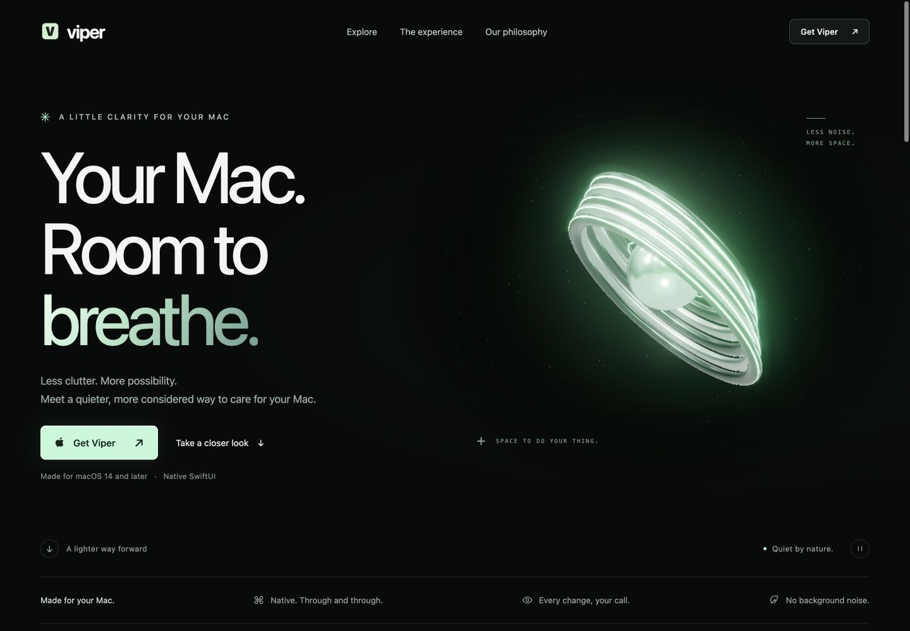
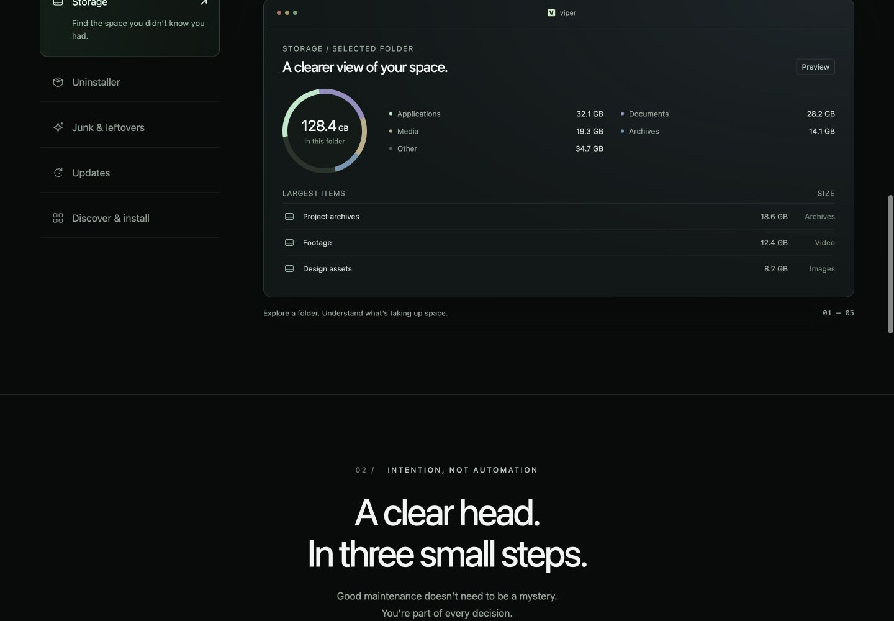
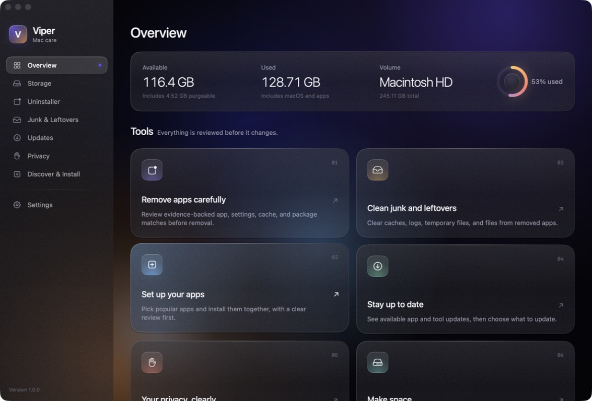

# Viper website: redesign decision

Status: audit and creative directions only. Awaiting the user's selection before changing website code. Local-only delivery remains required.

## What the product should feel like

Viper is a small, deliberate maintenance instrument. Its defining sequence is inspect → review → decide, with visible reasons for keeping files and explicit control over changes. It starts read-only, uses native macOS patterns, and does not keep a background agent running. The emotional result should be relief through understanding: a clear desk after sorting it yourself, rather than a mysterious optimizer promising speed.

Grounding: current native Viper Overview and Storage screens; README.md; Sources/Viper/StorageViews.swift, CleanupViews.swift, UninstallViews.swift, Theme.swift. No removal, scan, install, or permission reset was performed for this audit.

## Audit: patterns to remove

1. The header uses the exact logo-left / links-center / CTA-right formula the user rejects (index.html header).
2. The hero follows the conventional headline, supporting copy, two-action structure, with a decorative object beside it. Centering this unchanged would preserve the same formula.
3. Product images are absent. Every current in-page image is the app icon. The central product preview is invented HTML, not Viper's real interface (src/main.js).
4. The TorusGeometry sculpture and orbiting sphere do not explain Viper or any task it performs (src/scene.js). Their glow is generic spectacle.
5. Inter is declared without a loaded font, so the typography falls through to a system stack (src/style.css). The default-looking sans typography undermines the requested character.
6. Gradient-highlighted words, spaced uppercase eyebrows, arbitrary chapter numbers, dot accents, and diagonal arrows repeat as decoration rather than information.
7. Rounded buttons, rounded panels, subdued glow, and repeated hairline divisions create a familiar software-landing-page vocabulary.
8. Large fixed section padding gives every chapter nearly the same pace. There is no meaningful change of scale or image-driven visual rhythm.
9. The three-column process and split philosophy section recycle predictable marketing layouts. The preview also repeats icon-in-rounded-square rows.
10. The copy leans on interchangeable slogans: 'Less clutter. More possibility.', 'A lot of possibility.', and 'Make room for what’s next.' It avoids the concrete choices that make the product distinctive.
11. Large surfaces remain left-aligned; this does not meet the user's requested centered composition.
12. Type inside the example UI and secondary labels is small and frequently low contrast. Preserve the existing useful keyboard tab behavior and reduced-motion support, but retest contrast and responsive reflow in the new implementation.
13. The acquisition path repeats 'Get Viper' but delays the fact that this is a source build. State the source-build requirement at the first acquisition action.

Not claimed as current defects: no dark-mode toggle, no stock purple/blue site hero, no scroll-fade-on-every-section behavior. Existing native app screenshots contain their own violet light; preserve authentic product pixels while avoiding that as the website's surrounding visual theme.

## Evidence

### 1. Current hero

The header, system-like type, two actions, unrelated 3D object, repeated decorative micro-labels, and lack of app imagery are visible here.

### 2. Product / process transition

This viewport shows the invented preview and the large visual pause before another headline-and-copy section. This is not a native app screenshot. Source confirms the same image omission across the page.

### 3. Actual Viper Overview

The real app has a distinctive sidebar, volumetric information, and native glass panels. Product photography should be made from actual captures, with controlled demonstration data when a screen exposes filenames or installed software.

Evidence limits: this is a focused visual/code audit, not a complete accessibility certification. Screenshots do not establish contrast conformance, full keyboard behavior, or performance across devices. The final chosen design requires those checks.

## Direction A — The Darkroom

A photographic darkroom: charcoal, silver-white type, and narrow champagne light around large, real Viper screenshots. Bodoni Moda's editorial letterforms paired with IBM Plex Sans make the product feel carefully observed; every chapter is centered, but giant type sits behind and crosses the edges of the product photographs. The emotional aim is the moment a confusing image comes into focus.

Signature moments:
- Interaction: an accessible exposure/focus control brings one real app screen forward in a shallow Three.js stack; dragging and keyboard controls select the same screens.
- Layout: a centered app window overlaps enormous type; succeeding full-width screenshots and precise crops tell the actual inspect/review/decide sequence.
- Detail: a fine warm highlight traces the selected window edge and comes to rest when the interaction stops. No perpetual orbiting ornament.

Example copy: 'See what stays. Choose what goes.' One clearly identified source-build action, contextual to the product image. Navigation becomes a compact centered chapter index, separate from the acquisition action.

## Direction B — The Service Manual

A collectible industrial service manual: cool paper white, graphite, sharp rules, and a single acid-green accent, with large dark Viper screenshots as the visual anchors. Barlow Condensed provides poster-scale chapter titles and IBM Plex Mono provides precise annotations; every section sits on a centered axis with deliberate image overlaps and changes in scale. The emotional aim is competence: opening an instrument that makes the machine understandable.

Signature moments:
- Interaction: an inspection loupe enlarges genuine screenshot details, with click/keyboard zoom alternatives and readable HTML explanations.
- Layout: centered, oversized chapter numbers are interrupted by wide product captures, then give way to an enlarged review detail rather than another card grid.
- Detail: a thin Three.js glass inspection plate refracts only the screenshot area beneath it, linked to pointer movement and disabled under reduced motion. No decorative standalone object.

Example copy: 'Know your Mac. Keep the useful bits.' Single source-build action; compact centered contents rail rather than a conventional marketing header.

## Shared implementation commitments after selection

- Redesign the existing one-page website, its feature navigation, mobile menu, installation dialog, footer, and responsive states together. Do not invent extra routes.
- Center each section's composition and headline. Retain readable left-aligned text inside authentic app screenshots and factual captions when needed.
- Use real Viper captures throughout: hero overview, storage, app review, cleanup, and discovery where relevant. Prepare controlled local demo data; do not expose personal filenames in product imagery.
- Keep all runtime assets local, including licensed fonts and optimized product images.
- Preserve semantic controls, visible focus, useful image alternatives, touch controls, reduced motion, and a static fallback for WebGL.
- No scroll hijacking, decorative abstract blobs, repeated fade-in sections, invented testimonials, or guaranteed originality/award claims.
